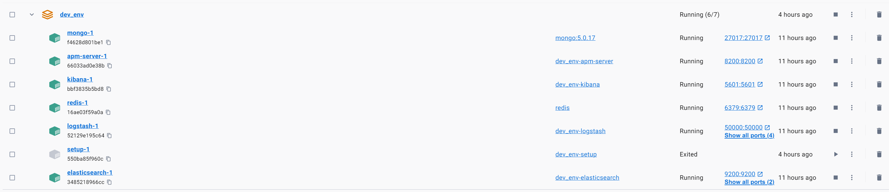
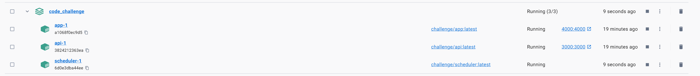

# Code Challenge

Code challenge project.

[](https://github.com/snys98/code_challenge/actions/workflows/ci.yml) [](https://github.com/snys98/code_challenge/actions/workflows/cd.yml)

## Tech Stack

- Backend(based on [Nest.js](https://nestjs.com/)):

  - ORM: [Mongoose](https://mongoosejs.com/)
  - Database: [MongoDB](https://www.mongodb.com/)
  - Cache: [Redis](https://redis.io/)
  - Authentication: Local [JWT](https://jwt.io/)
  - Authorization(Todo): [Casbin](https://casbin.org/) - [RBAC](https://en.wikipedia.org/wiki/Role-based_access_control)
  - Message Queue(Todo): [rabbitmq](https://docs.nestjs.com/microservices/rabbitmq)
  - Logging: [elk](https://www.elastic.co/what-is/elk-stack)
  - Migration: [migrate-mongoose](https://github.com/balmasi/migrate-mongoose)
- Frontend(very simple and basic, based on [React](https://reactjs.org/)):

  - UI: [Ant Design](https://ant.design/)
- TaskScheduler(Todo): [node-schedule](https://github.com/node-schedule/node-schedule)
- CI/CD:

  - [Docker](https://www.docker.com/)
  - [Docker Compose](https://docs.docker.com/compose/)
  - [Github Actions](https://docs.github.com/en/actions)
- Misc:

  - Testing: [Jest](https://jestjs.io/)

## Getting Started

Prerequisites:

- [Docker](https://www.docker.com/)
- [pwsh@^7](https://learn.microsoft.com/en-us/powershell/scripting/install/installing-powershell-on-windows?view=powershell-7.4)

1. run script in repo root folder using pwsh with administrator permission, and follow instructions
  ```pwsh
  .\start_containers.ps1
  ```
2. open browser and access the frontend at [https://app.dev.challenge](https://app.dev.challenge) and the backend at [https://api.dev.challenge](https://api.dev.challenge), swagger endpoint is at `/swagger`.

> Note: This project will setup a fresh local dev environment with all the dependencies running in docker containers, these dependencies may conflict with your local environment, port reservations: [6379, 27017, 9200, 9300, 8200, 9600, 5044, 50000,, 5601].
> If you already have some of the dependencies installed, please ensure they are not running before starting the project.

list of endpoints:
- [kibana](https://kibana.dev.challenge)
- [elasticsearch](https://elasticsearch.dev.challenge)
- [redis](https://redis.dev.challenge)
- [mongodb](https://mongo.dev.challenge)
- [apm-server](https://apm-server.dev.challenge)
- [logstash](https://logstash.dev.challenge)
- [api-health-check](https://api.dev.challenge)
- [api-swagger](https://api.dev.challenge/swagger)
  - [api-swagger-json](https://api.dev.challenge/swagger/json)
  - [api-swagger-yaml](https://api.dev.challenge/swagger/yaml)
- [app](https://app.dev.challenge)

## Development

Recommendations for better dev experience:

- Use [vscode workspace](https://code.visualstudio.com/docs/editor/workspaces) to open this project.
- Install recommended vscode extensions.

Steps to run the project:

1. Clone the project and open it in vscode
2. Open file `./.vscode/code_challenge.code-workspace` and press the `Open Workspace` button
3. Press `F1` and type `tasks: run task` and select `compose dev dependencies` task, wait for the dependencies to start(you might need to restart vscode after this step).
4. Ensure all the dependencies in stack of `dev_env` are running(except for `setup`), status should be like this.
   
5. Press `F1` and type `tasks: run task` and select `npm`, then select `npm install` in `ROOT` folder.
6. Press `F1` and type `tasks: run task` and select `start dev reverse proxy` task.
7. Copy and paste the `.\hosts` file content to your hosts file(or use [switchhosts](https://github.com/oldj/SwitchHosts) for better hosts management).
8. Ping `redis` to ensure the hosts file is configured correctly and the target should your localhost.
9. Press `F1` and type `tasks: run task` and select `build all` task, new stack of `code_challenge` should be running, and status should be like this.
   
10. Press `F1` and type `tasks: run task` and select `migrate up` task for generating test data.
11. Access the frontend at [https://app.dev.challenge](https://app.dev.challenge) and the backend at [https://api.dev.challenge](https://api.dev.challenge), swagger endpoint is at `/swagger`.

> see `.\dev_env\docker-compose` file for docker container dependencies
> see `.\dev_env\.env` file for elasticsearch and kibana passwords
> see `.\apps\api\.env.dev` file for api environment variables

## Testing

In the project root directory, run `npm run test` to run all the tests.

## Deployment

See `./.github/workflows/cd.yml` for deployment details.

## Q&A

todo
